# Docker概述

## Docker为什么会出现？

一款产品：开发---上线  两套环境！应用环境，应用配置！

开发---运维。问题：我在我的电脑上可以运行！版本更新导致服务不可用！对于运维来说，考验非常大！

环境配置十分麻烦，每个机器都要部署环境(集群Redis、ES、Hadoop....) 费时费力！

在一个服务器上配置一个应用环境：redis+mysql+jdk+es...，配置超级麻烦，并且不能跨平台！

如：windows发布到linux

传统：开发提供jar，运维部署上线。

Docker给以上问题，提出了解决方案！

Docker思想来自于集装箱，隔离是核心思想！打包装箱，相互隔离！

最终目的：将应用程序打包装箱，简化项目部署。

## Docker的历史

2010年在美国成立了一家`dotCloud`,开始是做一些pass云计算服务！

他们将自己的技术(容器化技术)命名，就是Docker！

Docker刚刚诞生的时候没有引起行业的注意，活不下去，于是想到了`开源`

2013年，Docker开源！越来越多的人发现Docker的有点，于是Docker就火了！

2014年4月，Docker1.0发布！

Docker为什么火？十分轻巧！

在容器技术之前，我们都是使用虚拟机技术！内存占用较大，十分笨重！

虚拟机：在windows中装一个Vmware，通过这个软件我们可以虚拟出来一台或者多台电脑，笨重！

虚拟机是虚拟化技术，Docker容器技术，本质上都是虚拟化技术！

> 聊聊Docker

Docker是基于Go语言开发的开源项目！

官网：https://www.docker.com/

文档地址：https://docs.docker.com/  Docker文档超级详细！

仓库地址：https://hub.docker.com/

## Docker能干嘛

> 之前的虚拟机技术！


虚拟机技术缺点：

1. 资源占用十分多！
2. 冗余步骤多！
3. 启动很慢！

> 容器化技术：`不是模拟的一个完整的操作系统`


比较Docker和虚拟机技术的不同：

- 传统虚拟机，虚拟出一套硬件，运行一个完整的操作系统，然后在这个系统上安装和运行软件
- 容器内的应用直接运行在宿主机的内容，容器是没有自己的内核的，也没有虚拟我们的硬件，所以就轻便了，每个容器间相互隔离，每个容器内都有一个属于自己的文件系统，互不影响！

> DevOps(开发、运维)

**应用更快速的交付和部署**

传统：一堆帮助文档，安装程序

Docker：打包镜像、发布测试、一键运行

**便捷的升级和扩缩容**

使用Docker之后，部署应用就想搭积木一样！

项目打包为一个镜像，扩展，服务器A！服务器B！直接运行镜像

**更简单的系统运维**

在容器化之后，我们的开发，测试环境都是高度一致的，不会说在“在我本地环境没有问题啊！！！”

**更高效的计算机资源利用**

Docker是内核级别的虚拟化，可以在一个物理机上运行运行很多的容器实例！服务器的性能可以被压榨到极致！

# Docker安装

## Docker的基本组成


**镜像(image)：** `docker镜像就好比是一个模板，可以通过这个模板来创建容器服务。比如可以通过一个.class(镜像)获取多个对象(容器)`

**容器(container)：**`docker利用容器技术，独立运行一个或者一组应用，通过镜像来创建的。`

**仓库(repository)：**`存放镜像的地方，分为公有镜像和私有镜像，类似maven仓库`

## 安装Docker

> 环境装备

1. Linux Centos7及以上
2. 系统内核3.10及以上：uname -r查看
3. 系统版本查看：cat /etc/os-release

> 安装

```shell
#1.卸载旧的版本
sudo yum remove docker \
                  docker-client \
                  docker-client-latest \
                  docker-common \
                  docker-latest \
                  docker-latest-logrotate \
                  docker-logrotate \
                  docker-engine
#2.需要的安装包
sudo yum install -y yum-utils
#3.设置镜像仓库
sudo yum-config-manager \
    --add-repo \
    https://download.docker.com/linux/centos/docker-ce.repo(默认是国外的，非常慢)
#更新yum软件包索引
yum makecache fast
#4.安装docker docker-ce 社区版 ee企业版
sudo yum install docker-ce docker-ce-cli containerd.io
#5.启动docker
sudo systemctl start docker
#6.使用docker version测试是否安装成功
#7.hello-world
sudo docker run hello-world
#8.查看镜像
docker images
#9.卸载docker
sudo yum remove docker-ce docker-ce-cli containerd.io  //卸载依赖
sudo rm -rf /var/lib/docker //删除资源
```

## 阿里云镜像加速

1. 登录阿里云找到专属加速地址

   

2. 配置使用

   ```shell
   sudo mkdir -p /etc/docker #创建目录
   #写入配置文件
   sudo tee /etc/docker/daemon.json <<-'EOF'
   {
     "registry-mirrors": ["https://e1hozels.mirror.aliyuncs.com"]
   }
   EOF
   #加载配置文件
   sudo systemctl daemon-reload
   #重启docker服务
   sudo systemctl restart docker
   ```

## 回顾Hello-world


## 底层原理

**Docker是怎么工作的？**

Docker是一个Client-Server结构的系统，Docker的守护进程运行在主机上。通过Socket从客户端访问。

Docker-Server接收到Docker-Client的指令，就会执行这个命令!


**Docker为什么比VM快？**

1. Docker有着比虚拟机更少的抽象层。
2. Docker利用的是宿主机的内核，VM需要的是Guest OS。


所以说新建一个容器的时候，Docker不需要像VM一样重新加载一个操作系统内核，避免引导。VM是加载Guest OS，分钟级别，而Docker是利用宿主机的操作系统，省略了这个复杂的过程，秒级。

# Docker常用命令

## 帮助命令

```shell
docker version			#查看docker版本信息
docker info					#显示docker的系统信息，包括镜像和容器的数量
docker 命令 --help	#帮助命令
docker stats 				#查看cpu状态
```

帮助文档地址：https://docs.docker.com/engine/reference/commandline

## 镜像命令

**docker images**：查看所有本地主机上的镜像 

```shell
 Just  ~  docker images         
REPOSITORY          TAG                 IMAGE ID            CREATED             SIZE
hello-world         latest              bf756fb1ae65        7 months ago        13.3kB

#解释
REPOSITORY			镜像的仓库源
TAG							镜像的标签
IMAGE ID				镜像ID
CREATED					镜像创建时间
SIZE						镜像大小
#可选项
	-a,--all			#列出所有镜像
	-q,--quiet		#只显示镜像的ID
```

**docker search**：搜索镜像

```shell
 Just  ~  docker search mysql
NAME     							DESCRIPTION        								STARS    OFFICIAL        AUTOMATED
mysql   MySQL is a widely used, open-source relation…   9859      [OK]                
#可选项
--filter=STARS=3000				#搜索STARS大于3000的镜像
```

**docker pull**：下载镜像

```shell
#下载镜像：docker pull 镜像名[:tag]
Just  ~  docker pull mysql  
Using default tag: latest			#如果不写tag，默认是罪行版本
latest: Pulling from library/mysql
bf5952930446: Pull complete 	#分层下载，docker image的核心，联合文件系统
8254623a9871: Pull complete 
938e3e06dac4: Pull complete 
ea28ebf28884: Pull complete 
f3cef38785c2: Pull complete 
894f9792565a: Pull complete 
1d8a57523420: Pull complete 
6c676912929f: Pull complete 
ff39fdb566b4: Pull complete 
fff872988aba: Pull complete 
4d34e365ae68: Pull complete 
7886ee20621e: Pull complete 
Digest: sha256:c358e72e100ab493a0304bda35e6f239db2ec8c9bb836d8a427ac34307d074ed		#签名
Status: Downloaded newer image for mysql:latest
docker.io/library/mysql:latest		#真实地址
```

**docker rmi**：删除镜像

```shell
docker rmi -f 容器ID [容器ID]				#删除指定[批量]的镜像
docker rmi -f $(docker images -aq) #删除全部的镜像
```

## 容器命令

**说明：有了镜像才可以创建容器并运行，下载一个centos来测试学习**

```shell
docker pull centos
```

**新建容器并启动**

```shell
docker run [可选参数] image
#参数说明
--name="name"  #指定容器名字
-d						 #以后台方式运行
-it						 #使用交互方式运行，进入容器查看内容
-p						 #指定容器端口，如：
		-p ip:主机端口:容器端口
		-p 主机端口:容器端口
		-p 容器端口
		容器端口(直接指定容器端口)
-P						 #随机指定容器端口
--rm					 #用完就删除容器和镜像
#启动并进入容器
Just  ~  docker run -it centos /bin/bash   
[root@963f615aa301 /]# ls
bin  dev  etc  home  lib  lib64  lost+found  media  mnt  opt  proc  root  run  sbin  srv  sys  tmp  usr  var
```

**退出容器**

```shell
exit			#直接停止容器并退出
Ctrl+P+Q	#容器不停止，并退出容器
```

**列出所有运行的容器**

```shell

docker ps 
				#列出当前正在运行的容器
	-a		#列出所有当前正在运行的容器+历史运行过的容器
	-n=?	#显示最近创建的容器，？显示几个
	-q		#只显示容器的编号
```

**删除命令**

```shell
docker rm 容器ID								#删除指定容器，不能删除正在运行的容器，如果要强制删除，使用-f参数
docker rm -f $(docker ps -aq)	 #删除所有的容器
docker ps -a -q | xargs docker rm			#同样是删除所有容器
```

**启动和停止容器的操作**

```shell
docker start 容器ID					#启动容器
docker restart 容器ID				#重启容器
docker stop 容器ID					#停止容器
docker kill 容器ID					#强制停止容器
```

## 常用其他命令

**后台启动容器**

```shell
docker run -d 镜像名
#问题：使用docker ps时，发现通过镜像名启动的容器停止了
#常见的坑：docker容器使用后台运行，就必须要有一个前台进程，docker发现没有应用，就会自动停止
#如启动nginx容器，容器启动后发现自己没有提供服务，就会立刻停止，就没有程序了
```

**查看日志**

```shell
docker logs -f -t [--tail 显示条数] 容器ID
#由于没有日志，自己写一段shell脚本产生日志
docker run -d centos /bin/sh -c "while true;do echo ceshiyixia;sleep 1;done;"
#使用“docker logs -f -t --tail [显示条数] 容器ID”显示日志
```

**查看容器中的进程信息**

```shell
docker top 容器ID
```

**查看镜像元数据**

```shell
docker inspect 容器ID\镜像ID
```

**进入当前正在运行的容器**

```shell
#我们通常容器都是后台方式运行的，如需要进入容器修改一些配置等。。。
#进入容器方式一
docker exec -it 容器ID bashShell
#进入容器方式二
docker attach 容器ID

#两种方式的区别
#docker exec			#进入容器后开启新的终端，可以在里面操作(常用)
#docker attach 		#进入容器正在运行的终端，不会启动新的进程
```

**从容器中拷贝文件到主机**

```shell
docker cp 容器ID:容器内路径 目的的主机路径
#目前该命令是通过手动的方式copy，未来我们使用-v 卷的技术，可以实现指定目录的数据同步
```

## 命令小结

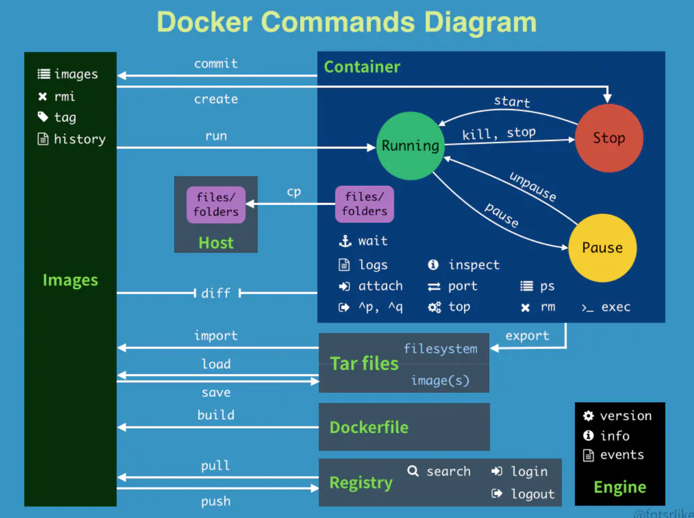

```shell
`attach` 	Attach to a running container 									#当前shell下attach连接指定运行镜像
`build` 	Build an image from a Dockerfile 								#通过Dockerfile定制镜像
`commit` 	Create a new image from a container changes 		#提交当前容器为新的镜像
`cp` 			Copy files/folders from a container to a HOSTDIR or to STDOUT #从容器中拷贝指定文件或者目录到宿主机中
`create` 	Create a new container 													#创建一个新的容器，同run 但不启动容器
`diff` 		Inspect changes on a container filesystem 			#查看docker容器变化
`events` 	Get real time events from the server						#从docker服务获取容器实时事件
`exec` 		Run a command in a running container						#在已存在的容器上运行命令
`export` 	Export a containers filesystem as a tar archive #导出容器的内容流作为一个tar归档文件(对应import)
`history` Show the history of an image 										#展示一个镜像形成历史
`images`  List images  																		#列出系统当前镜像
`import`  Import the contents from a tarball to create a filesystem image  #从tar包中的内容创建一个新的文件系统映像(对应export)
`info`    Display system-wide information  								#显示系统相关信息
`inspect` Return low-level information on a container or image  #查看容器详细信息
`kill`    Kill a running container  											#kill指定docker容器
`load`    Load an image from a tar archive or STDIN  			#从一个tar包中加载一个镜像(对应save)
`login`   Register or log in to a Docker registry					#注册或者登陆一个docker源服务器
`logout`  Log out from a Docker registry  								#从当前Docker registry退出
`logs`    Fetch the logs of a container  									#输出当前容器日志信息
`pause`   Pause all processes within a container					#暂停容器
`port`    List port mappings or a specific mapping for the CONTAINER  #查看映射端口对应的容器内部源端口
`ps`    	List containers  																#列出容器列表
`pull`    Pull an image or a repository from a registry #从docker镜像源服务器拉取指定镜像或者库镜像
`push`    Push an image or a repository to a registry  	#推送指定镜像或者库镜像至docker源服务器
`rename`  Rename a container  														#重命名容器
`restart` Restart a running container  										#重启运行的容器
`rm`    	Remove one or more containers  									#移除一个或者多个容器
`rmi`    	Remove one or more images  #移除一个或多个镜像(无容器使用该镜像才可以删除，否则需要删除相关容器才可以继续或者-f强制删除)
`run`    	Run a command in a new container  							#创建一个新的容器并运行一个命令
`save`    Save an image(s) to a tar archive								#保存一个镜像为一个tar包(对应load)
`search`  Search the Docker Hub for images  							#在docker hub中搜索镜像
`start`   Start one or more stopped containers						#启动容器
`stats`   Display a live stream of container(s) resource usage statistics  #统计容器使用资源
`stop`    Stop a running container  											#停止容器
`tag`     Tag an image into a repository  								#给源中镜像打标签
`top`     Display the running processes of a container 		#查看容器中运行的进程信息
`unpause` Unpause all processes within a container  			#取消暂停容器
`version` Show the Docker version information							#查看容器版本号
`wait`    Block until a container stops, then print its exit code  #截取容器停止时的退出状态值
```

## 实战

> 安装nginx

```shell
#通过docker search命令查找nginx，建议到docker hub查找镜像，信息比较全面
docker search nginx
#通过docker pull拉取镜像
docker pull nginx
#通过docker run命令运行nginx
docker run -d --name nginx01 -p 3344:80 nginx
#通过docker exec命令进入容器
docker exec -it nginx01 /bin/bash
```

> 安装tomcat

```shell
#通过docker search命令查找tomcat，建议到docker hub查找镜像，信息比较全面
docker search tomcat
#通过docker pull拉取镜像
docker pull tomcat:9.0
#通过docker run命令运行nginx
docker run -d --name tomcat01 -p 3355:8080 tomcat:9.0
#通过docker exec命令进入容器
docker exec -it tomcat01 /bin/bash
#发现问题
#1.linux命令少了(没有ll命令)
#2.没有webapps
#阿里云镜像的原因，默认是最小的镜像，所有不必要的都提出到，保证最小可运行环境。(可以将webapps.dist目录下所有东西拷贝到webapps下)
```

> 部署ES+Kibana(?)

```shell
#es 暴露的端口很多！十分耗内存、数据一般需要放置到安全目录！(挂载)
#启动命令
#--net somenetwork？ 网络配置,后面docker网络讲，暂时不用
docker run -d --name elasticsearch [--net somenetwork] -p 9200:9200 -p 9300:9300 -e "discovery.type=single-node" elasticsearch:7.6.2
#启动后linux变得非常卡,通过docker stats查看docker状态，发现es将内存占满！！！！
#为了解决内存占用问题，可以通过-e(修改环境配置) 增加内存的限制
docker run -d --name elasticsearch -p 9200:9200 -p 9300:9300 -e "discovery.type=single-node" -e ES_JAVA_OPTS="-Xms64m -Xmx1024m" elasticsearch:7.6.2
```

# Docker可视化

> Portainer (先用这个)

**什么是Portainer？**

docker图形化界面管理工具，提供一个后台面板供我们使用！

```shell
docker run -d -p 8088:9000 --restart=always -v /var/run/docker.sock:/var/run/docker.sock --privileged=true portainer/portainer
#访问测试：外网地址：8088
```

> Rancher (CI/CD再用)

# Docker镜像讲解

## 镜像定义

镜像是一种轻量级，可执行的独立软件包，用来打包软件运行环境和基于运行环境开发的软件，它包含某个软件运行所需的所有内容，包括代码、运行时、库、环境变量和配置文件。

所有的应用直接打包docker镜像，运维直接运行起来。

如何得到镜像:

- 从远程仓库下载
- 别人拷贝给你
- 自己制作一个镜像DockerFile

## 加载原理

> UnionFS(联合文件系统)

UnionFS(联合文件系统)：Union(联合)文件系统(UnionFS)是一种分层、轻量级并且高性能的文件系统，它支持对文件系统的修改作为一次提交来一层层叠加，同时可以将不同目录挂载到同一个虚拟文件系统下。UnionFS是Docker镜像的基础，Docker可通过分层来进行继承，基于基础镜像(没有父镜像)，可以制作各种具体的应用镜像。

特性：一次同时加载多个文件系统，但从外面看起来，只能看到一个文件系统，联合加载会把各层文件系统叠加起来，这样最终的文件系统会包含所有底层的文件和目录。

> Docker镜像加载原理

Docker的镜像实际上是由一层层文件系统组成，这种层级的文件系统UnionFS。

bootfs(boot file system)主要包含bootloder和kernel，bootloader主要引导加载kernel，Linux刚启动时会加载bootfs文件系统，在Docker镜像最底层是bootfs。这一层与我们典型的Linux/Unix系统是一样的，包含boot加载器和内核。当boot加载完成之后整个内核都在内存中了，此时内存的使用权已有bootfs转交给内核，此时系统也会卸载bootfs

rootfs(root file system)在bootfs之上。包含的就是典型Linux系统中的/dev、/proc、/bin、/etc等标准目录和文件。rootfs就是各种不同操作系统发行版，比如Ubuntu、Centos等。

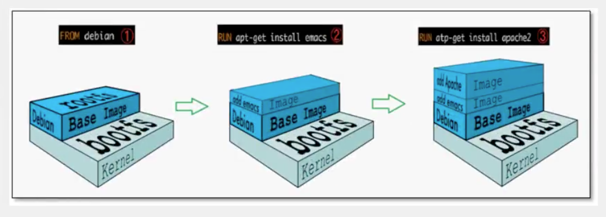

平时我们安装进虚拟机的centos都是好几个G，为什么Docker这里才200M？

对于一个精简的OS，rootfs可以很小，只需要包含最基本的命令，工具和程序库就可以了，因为底层直接用Host的Kernel，自己只需要提供rootfs就可以了。由此可见对于不同的Linux发行版，bootfs基本一样，rootfs会有差别，因此不同的发行版可以共用bootfs。

## 分层理解

Docker镜像采用分层结构目的是为了资源共享。

> **理解**

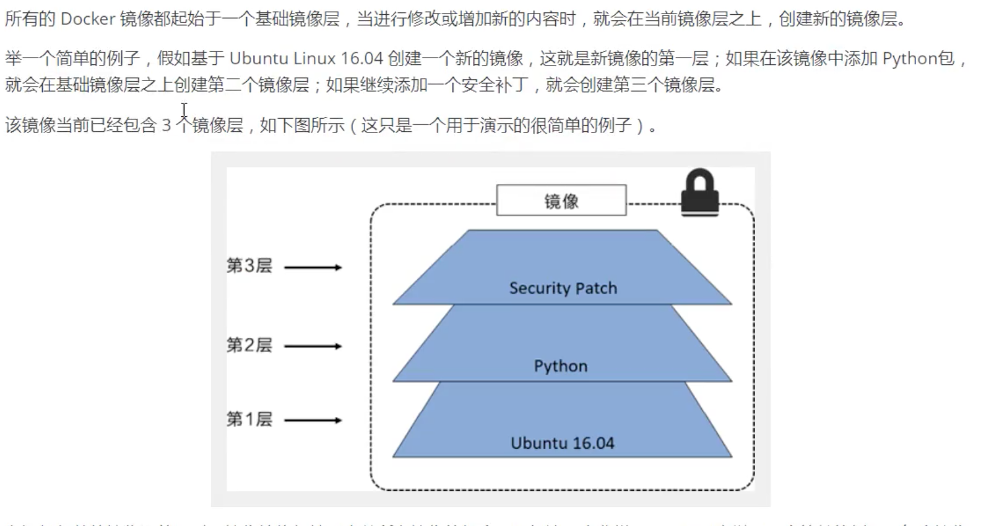

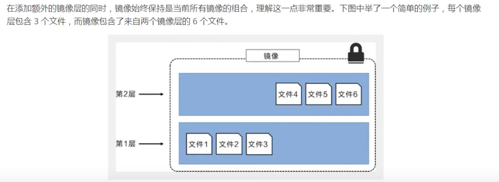

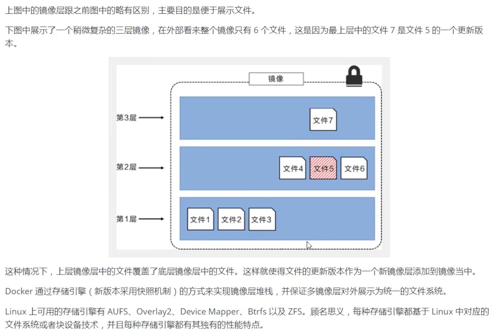

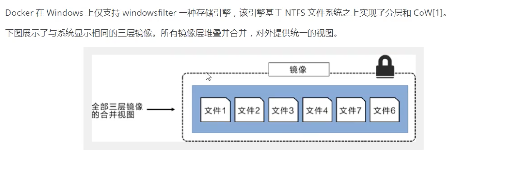

> 特点

Docker镜像都是只读的，当容器启动时，一个新的可写层被加载到镜像的顶部！

这就是我们通常说的容器层，容器之下的都叫镜像层。

## Commit镜像

```shell
docker commit 提交容器成为一个新的副本
#命令和git原理类似
docker commit -m "提交的描述信息" -a “作者” 容器ID 目标镜像名[:TAG]
```

**实战测试**

```shell
#启动一个默认的tomcat容器
docker start tomcat01
#启动后发现tomcat容器的webapps目录是空的
cd webapps & ls 
#将webapps.dist目录下的所有文件copy到webapps目录下
cp -r ../webapps.dist/* ./
#想将当前tomcat容器的状态做为一个自己的镜像
docker commit -a "Just" -m "add webapps" 容器ID 目标镜像名称[:版本]
#通过命令查看自己创建的镜像
docker images
#下次可以直接启动我们自己创建的镜像就行，类似将app部署到tomcat，然后将tomcat和app一起生产一个镜像
```

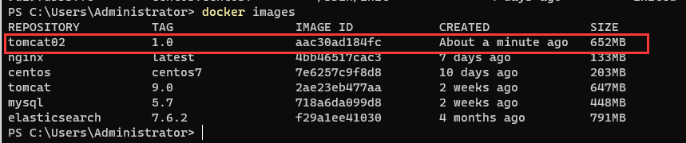

# 容器数据卷

## 什么是容器数据卷

**docker的理念回顾**

将应用和环境打包成镜像！

如果数据都在容器中，那么我们将容器删除，数据也随之删除，会造成数据丢失，那么需要对数据做持久化处理。

比如将mysql数据库中的数据存储在本地，容器之间可以有一个数据共享的技术，容器中产生的数据，同步到本地

这就是卷技术，直白说就是目录的挂载，将我们容器内的目录，挂载到Linux上！

**总结一句话：容器的持久化和同步操作！容器间也是可以数据共享的！**

## 使用数据卷

> 方式一：直接使用命令挂载 -v，类似-p的端口映射

```shell
docker run -it -v 主机目录:容器内目录 镜像名称 执行命令
#测试，将容器中的/home目录映射到本机的/Users/admin/Share/ceshi目录
docker run -it -p 6666:22 -v /Users/admin/Share/ceshi:/home --name centos7-1 centos /bin/bash
#使用docker inspect 查看容器挂载情况
```

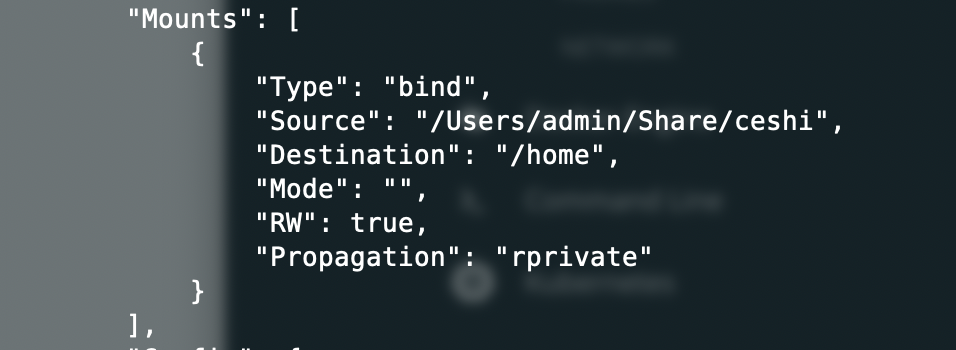

该情况数据是双向绑定的，无论修改那边的目录数据，都会同步到另外一端。

## 实战：安装Mysql

思考：Mysql的数据持久化问题！

```shell
#获取mysql镜像
docker pull mysql:5.7
#运行镜像并做配置文件和数据文件做挂载,并指定mysql密码
docker run -d --name mysql01 -p 3306:3306 -v /Users/admin/share/mysql/conf:/etc/mysql/conf.d [-v /Users/admin/share/mysql/data:/var/lib/mysql] -e MYSQL_ROOT_PASSWORD=123456 mysql:5.7
```

启动成功后通过navcat可以建立连接,然后创建测试数据库，发现挂载的目录是同步的

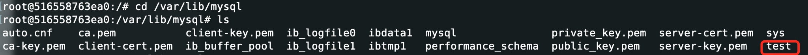

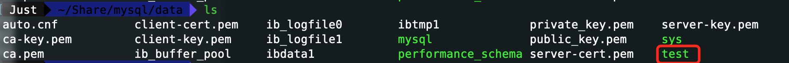

当删除该容器时挂载到本地的数据是不会被删除的，实现了数据的持久化。

## 具名和匿名挂载

```shell
#匿名挂载(-v 只指定了容器内的路径)
-v 容器内路劲
docker run -d -P --name nginx01 -v /etc/nginx nginx
#查看所有卷的情况
docker volume ls

#具名挂载(-v 指定了容器内的路径，并给挂载去取了一个名字)
-v 卷名:容器内路径
docker run -d -P --name nginx02 -v juming-nginx:/etc/nginx nginx
#查看一下这个卷
```

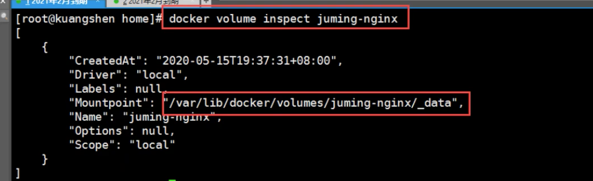

所有的docker容器内的卷，没有指定目录的情况下，都是在`/var/lib/docker/volumes/卷名/_data`下面

通过具名挂载可以很方便找到我们的一个卷，大多数情况使用`具名挂载`

```shell
#如何确定是具名挂载还是匿名挂载
-v 容器内路径					#匿名挂载
-v 卷名：容器内路径			#具名挂载
-v /宿主机路径：容器内路径 #指定路径挂载


#拓展，通过-v 容器内路径:ro/rw改变容器内路径的读写权限
#ro:readonly			只读，只能通过挂载的宿主机路径修改，不能在容器内修改
#rw:readwrite			可读可写
docker run -d -P --name nginx02 -v juming-nginx:/etc/nginx:ro nginx
docker run -d -P --name nginx02 -v juming-nginx:/etc/nginx:rw nginx
```

## 初识DockerFile

DockerFile就是构建Docker镜像的构建文件！其实就是一个命令脚本

> 方式二：使用DockerFile

```shell
#创建一个dockerfile文件，名字可以随意，建议是dockerfile
#文件中的内容 指令(大写) 参数
FROM centos #基础
VOLUME ["volume1","volume2"] #挂载
CMD echo "---------end--------" #输出
CMD /bin/bash	#进入bash
#这里的每个命令就是镜像的一层
#通过docker build 命令构建镜像
docker build -f dockerfile文件地址 -t 镜像名称:tag .
#运行该镜像，就会自动将容器内路径volume1和volume2做匿名挂载
```

## 数据卷容器

多个mysql之间同步数据，可以通过--volumes-from指定挂载的容器，实现通过，如：

```shell
docker run -d --name mysql01 -p 3306:3306 mysql:5.7
#通过--volumes-from挂载mysql01,实现mysql01与mysql02的双向同步
docker run -d --name mysql02 -p 3307:3306 --volumes-from mysql01 mysql:5.7
#当彻底删除容器mysql01时，mysql02的数据还是存在，两者是双向copy技术，不是共享技术
```

**结论：**容器之间配置信息的传递，数据卷容器的生命周期一直持续到没有容器使用为止！但是一旦持久化到了本地，这个时候本地的数据是不会删除的。

# DockerFile

## DockerFile介绍

dockerFile是用来构建docker镜像文件，命令参数脚本！

构建步骤：

1. 编写一个dockerfile文件
2. docker build 构建成为一个镜像
3. docker run 运行镜像
4. docker push 发布镜像(DockerHub、阿里云镜像仓库)

Docker Hub中所有的镜像都是一个DockerFile文件，如centos7：

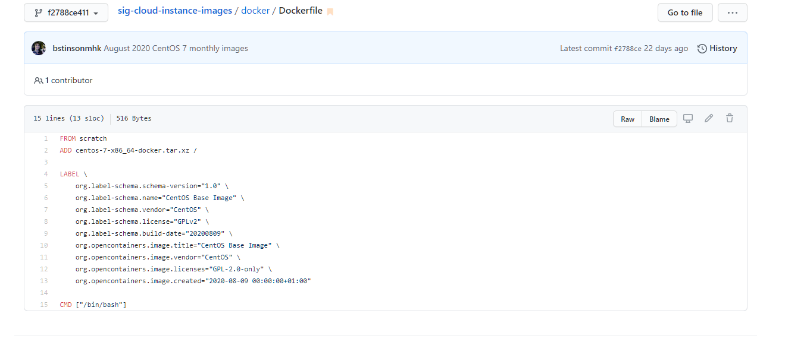

很多官方镜像只是一个基础镜像，很多功能没有，我们通常会自己搭建自己的镜像！

## DockerFile构建过程

**基础知识：**

1. 每个保留关键字(指令)都必须是大写字母

2. 从上到下执行命令

3. #表示注释

4. 每一个指定都会创建提交一个镜像层，并提交！

   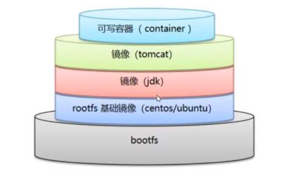

DockerFile是面向开发的，我们以后要发布项目，做镜像，就需要编写dockerfile文件，这个文件十分简单！

Docker镜像逐渐成为了企业交付的标准，必须要掌握！

**步骤：**开发、部署、运维

DockerFile：构建文件，定义了一切步骤，源代码！

DockerImages：通过DockerFile构建生产的镜像，就是我们最终要发布和运行的产品！

Docker容器：容器就是镜像运行起来提供服务！

## DcokerFile指令

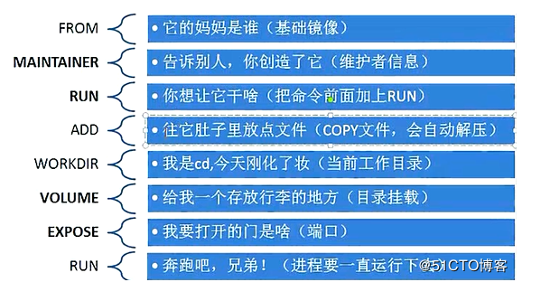

```shell
FROM					#基础镜像，一切从这里开始构建
MAINTAINER				#镜像是谁写的，姓名+邮箱
RUN						#镜像构建时需要运行的命令
ADD						#比如需要添加本地tomcat，需要将tomcat打成压缩包，这个压缩包就是要添加的文件！
WORKDIR					#镜像的工作目录
VOLUME					#挂载的目录位置
EXPOSE					#暴露端口配置，和-p一样
CMD						#指定容器启动时要运行的命令,只有最后一个命令会生效，可被替代
ENTRYPOINT				#指定容器启动时要运行的命令，可以追加命令
ONBUILD					#当构建一个被继承DockerFile，这个时候就会运行ONBUILD指定。触发指令
COPY					#类似ADD命令，将文件拷贝到镜像中
ENV						#构建时，设置环境变量
```

## 实战测试

Docker Hub中99%镜像都是从这个基础镜像过来的FROM scratch，然后配置需要的软件和配置来进行构建

> 创建一个自己的centos

1. 创建并编辑DockerFile

   ```shell
   FROM centos
   MAINTAINER Just<17780484850@163.com>
   ENV MYPATH C:\Users\Administrator
   WORKDIR $MYPATH
   RUN yum -y install vim
   RUN yum -y install net-tools
   EXPOSE 80
   CMD echo $MYPATH
   CMD echo "---------end-----------"
   CMD /bin/bash
   ```

2. 通过DockerFile构建镜像

   ```shell
   docker build -f mydockerfile -t mycentos:1.0 .
   #构建完成
   Successfully built d9dcbcd7aaad
   Successfully tagged mycentos:1.0
   ```

3. 运行镜像，并验证

   ```shell
   docker run -it mycentos:1.0
   ```

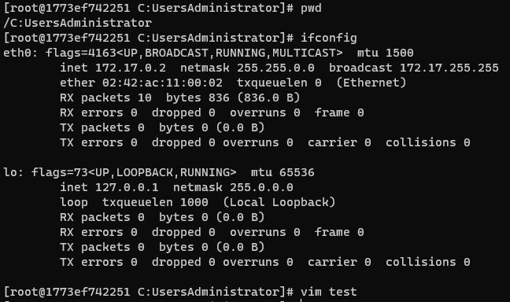

可以通过docker history 镜像ID 查看该镜像构建步骤，拿到镜像后，可以查看研究一下别人怎么做的。

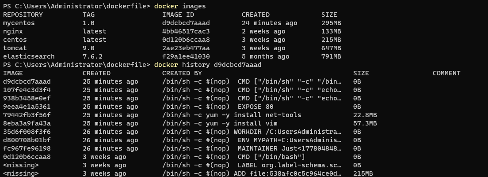

> CMD 和 ENTRYPOINT	区别

```shell
CMD						#指定容器启动时要运行的命令,只有最后一个命令会生效，可被替代
#比如在dockerFile中最后的CMD命令是
CMD ["ls"，"-a"],如果直接进入容器，那么会默认执行ls -a，如果想要修改执行命令，可以通过
docker run -it 镜像id 完整命令，如：docker run -it 镜像id -l

ENTRYPOINT				#指定容器启动时要运行的命令，可以追加命令
#比如在dockerFile中最后的CMD命令是
CMD ["ls"，"-a"],如果直接进入容器，那么会默认执行ls -a，如果想要修改执行命令，可以通过
docker run -it 镜像id 追加命令,如：docker run -it 镜像id -l 最终执行的完整命令是：ls -al
```


# Docker网络

