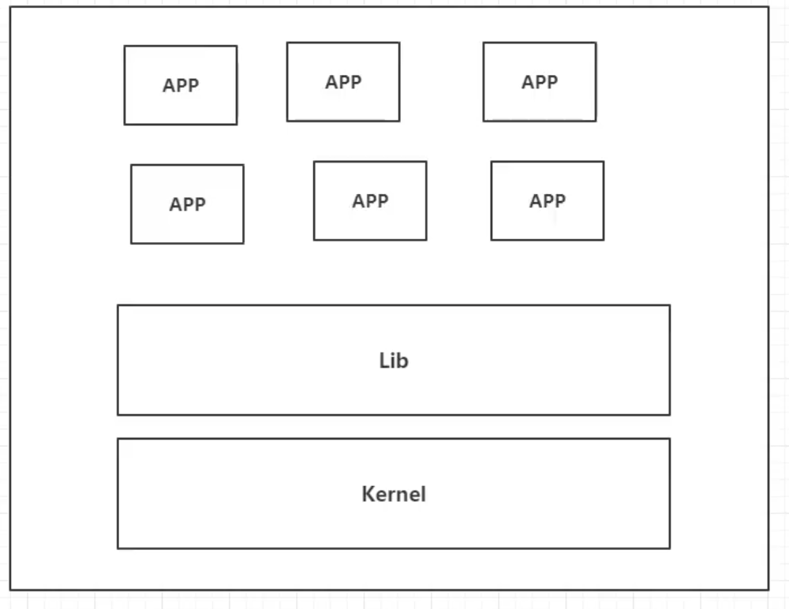
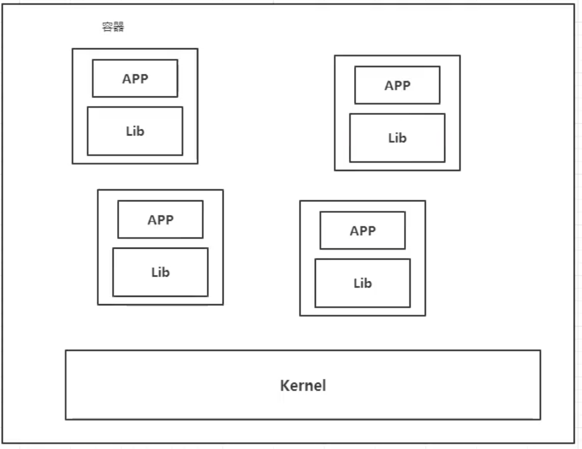
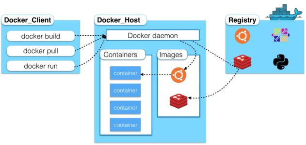
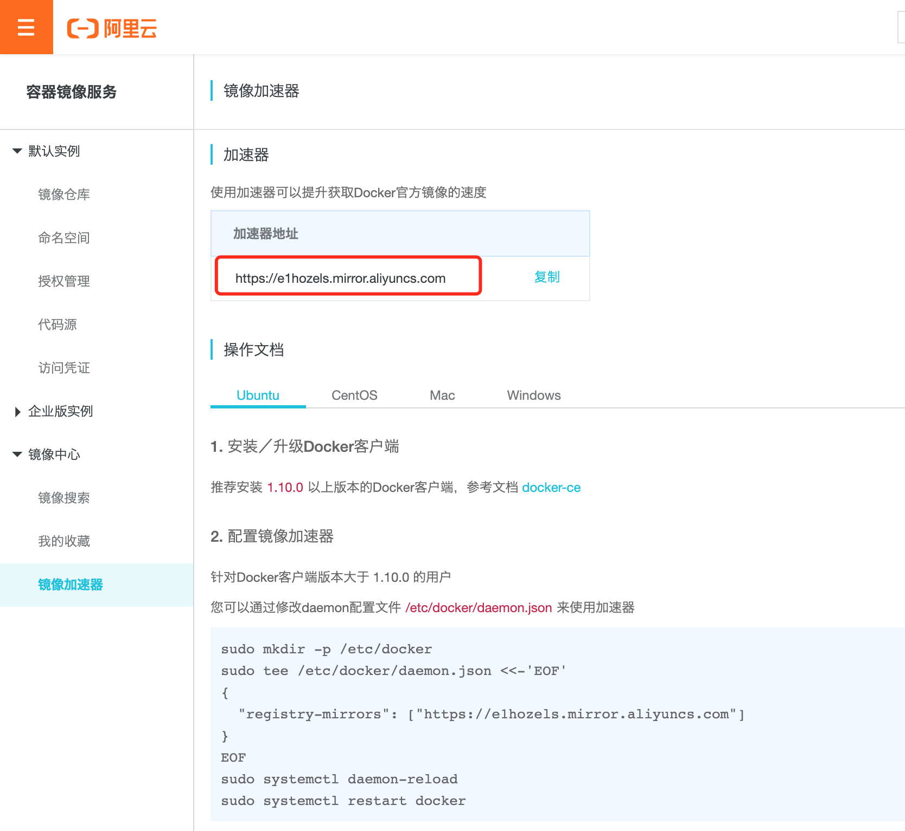
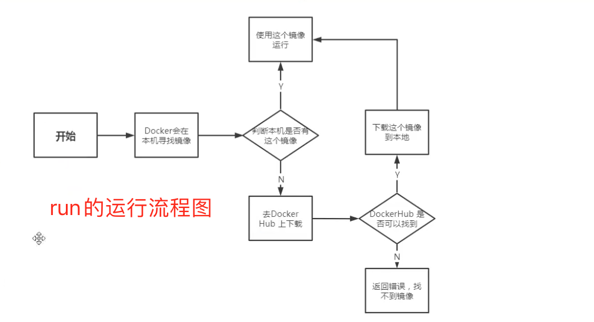
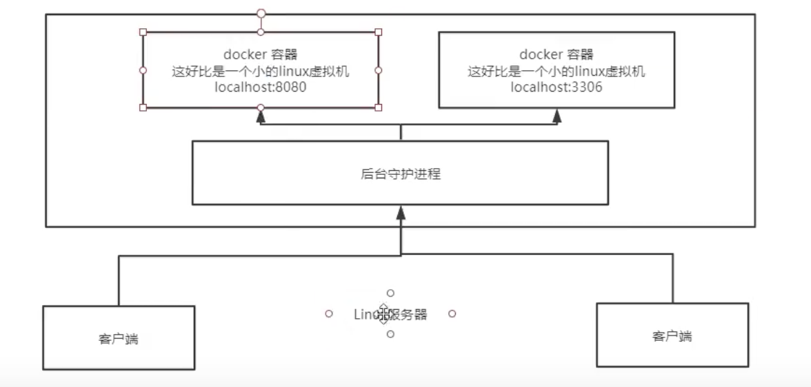
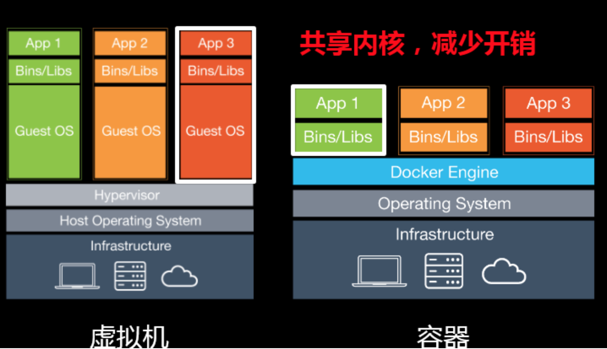

# Docker概述

## Docker为什么会出现？

一款产品：开发---上线  两套环境！应用环境，应用配置！

开发---运维。问题：我在我的电脑上可以运行！版本更新导致服务不可用！对于运维来说，考验非常大！

环境配置十分麻烦，每个机器都要部署环境(集群Redis、ES、Hadoop....) 费时费力！

在一个服务器上配置一个应用环境：redis+mysql+jdk+es...，配置超级麻烦，并且不能跨平台！

如：windows发布到linux

传统：开发提供jar，运维部署上线。

Docker给以上问题，提出了解决方案！

Docker思想来自于集装箱，隔离是核心思想！打包装箱，相互隔离！

最终目的：将应用程序打包装箱，简化项目部署。

## Docker的历史

2010年在美国成立了一家`dotCloud`,开始是做一些pass云计算服务！

他们将自己的技术(容器化技术)命名，就是Docker！

Docker刚刚诞生的时候没有引起行业的注意，活不下去，于是想到了`开源`

2013年，Docker开源！越来越多的人发现Docker的有点，于是Docker就火了！

2014年4月，Docker1.0发布！

Docker为什么火？十分轻巧！

在容器技术之前，我们都是使用虚拟机技术！内存占用较大，十分笨重！

虚拟机：在windows中装一个Vmware，通过这个软件我们可以虚拟出来一台或者多台电脑，笨重！

虚拟机是虚拟化技术，Docker容器技术，本质上都是虚拟化技术！

> 聊聊Docker

Docker是基于Go语言开发的开源项目！

官网：https://www.docker.com/

文档地址：https://docs.docker.com/  Docker文档超级详细！

仓库地址：https://hub.docker.com/

## Docker能干嘛

> 之前的虚拟机技术！



虚拟机技术缺点：

1. 资源占用十分多！
2. 冗余步骤多！
3. 启动很慢！

> 容器化技术：`不是模拟的一个完整的操作系统`



比较Docker和虚拟机技术的不同：

- 传统虚拟机，虚拟出一套硬件，运行一个完整的操作系统，然后在这个系统上安装和运行软件
- 容器内的应用直接运行在宿主机的内容，容器是没有自己的内核的，也没有虚拟我们的硬件，所以就轻便了，每个容器间相互隔离，每个容器内都有一个属于自己的文件系统，互不影响！

> DevOps(开发、运维)

**应用更快速的交付和部署**

传统：一堆帮助文档，安装程序

Docker：打包镜像、发布测试、一键运行

**便捷的升级和扩缩容**

使用Docker之后，部署应用就想搭积木一样！

项目打包为一个镜像，扩展，服务器A！服务器B！直接运行镜像

**更简单的系统运维**

在容器化之后，我们的开发，测试环境都是高度一致的，不会说在“在我本地环境没有问题啊！！！”

**更高效的计算机资源利用**

Docker是内核级别的虚拟化，可以在一个物理机上运行运行很多的容器实例！服务器的性能可以被压榨到极致！

# Docker安装

## Docker的基本组成



**镜像(image)：** `docker镜像就好比是一个模板，可以通过这个模板来创建容器服务。比如可以通过一个.class(镜像)获取多个对象(容器)`

**容器(container)：**`docker利用容器技术，独立运行一个或者一组应用，通过镜像来创建的。`

**仓库(repository)：**`存放镜像的地方，分为公有镜像和私有镜像，类似maven仓库`

## 安装Docker

> 环境装备

1. Linux Centos7及以上
2. 系统内核3.10及以上：uname -r查看
3. 系统版本查看：cat /etc/os-release

> 安装

```shell
#1.卸载旧的版本
sudo yum remove docker \
                  docker-client \
                  docker-client-latest \
                  docker-common \
                  docker-latest \
                  docker-latest-logrotate \
                  docker-logrotate \
                  docker-engine
#2.需要的安装包
sudo yum install -y yum-utils
#3.设置镜像仓库
sudo yum-config-manager \
    --add-repo \
    https://download.docker.com/linux/centos/docker-ce.repo(默认是国外的，非常慢)
#更新yum软件包索引
yum makecache fast
#4.安装docker docker-ce 社区版 ee企业版
sudo yum install docker-ce docker-ce-cli containerd.io
#5.启动docker
sudo systemctl start docker
#6.使用docker version测试是否安装成功
#7.hello-world
sudo docker run hello-world
#8.查看镜像
docker images
#9.卸载docker
sudo yum remove docker-ce docker-ce-cli containerd.io  //卸载依赖
sudo rm -rf /var/lib/docker //删除资源
```

## 阿里云镜像加速

1. 登录阿里云找到专属加速地址

   

2. 配置使用

   ```shell
   sudo mkdir -p /etc/docker #创建目录
   #写入配置文件
   sudo tee /etc/docker/daemon.json <<-'EOF'
   {
     "registry-mirrors": ["https://e1hozels.mirror.aliyuncs.com"]
   }
   EOF
   #加载配置文件
   sudo systemctl daemon-reload
   #重启docker服务
   sudo systemctl restart docker
   ```

## 回顾Hello-world



## 底层原理

**Docker是怎么工作的？**

Docker是一个Client-Server结构的系统，Docker的守护进程运行在主机上。通过Socket从客户端访问。

Docker-Server接收到Docker-Client的指令，就会执行这个命令!



**Docker为什么比VM快？**

1. Docker有着比虚拟机更少的抽象层。
2. Docker利用的是宿主机的内核，VM需要的是Guest OS。



所以说新建一个容器的时候，Docker不需要像VM一样重新加载一个操作系统内核，避免引导。VM是加载Guest OS，分钟级别，而Docker是利用宿主机的操作系统，省略了这个复杂的过程，秒级。

# Docker常用命令

## 帮助命令

```shell
docker version			#查看docker版本信息
docker info					#显示docker的系统信息，包括镜像和容器的数量
docker 命令 --help	#帮助命令
```

帮助文档地址：https://docs.docker.com/engine/reference/commandline

## 镜像命令

**docker images**：查看所有本地主机上的镜像 

```shell
 Just  ~  docker images         
REPOSITORY          TAG                 IMAGE ID            CREATED             SIZE
hello-world         latest              bf756fb1ae65        7 months ago        13.3kB

#解释
REPOSITORY			镜像的仓库源
TAG							镜像的标签
IMAGE ID				镜像ID
CREATED					镜像创建时间
SIZE						镜像大小
#可选项
	-a,--all			#列出所有镜像
	-q,--quiet		#只显示镜像的ID
```

**docker search**：搜索镜像

```shell
 Just  ~  docker search mysql
NAME     							DESCRIPTION        								STARS    OFFICIAL        AUTOMATED
mysql   MySQL is a widely used, open-source relation…   9859      [OK]                
#可选项
--filter=STARS=3000				#搜索STARS大于3000的镜像
```

**docker pull**：下载镜像

```shell
#下载镜像：docker pull 镜像名[:tag]
Just  ~  docker pull mysql  
Using default tag: latest			#如果不写tag，默认是罪行版本
latest: Pulling from library/mysql
bf5952930446: Pull complete 	#分层下载，docker image的核心，联合文件系统
8254623a9871: Pull complete 
938e3e06dac4: Pull complete 
ea28ebf28884: Pull complete 
f3cef38785c2: Pull complete 
894f9792565a: Pull complete 
1d8a57523420: Pull complete 
6c676912929f: Pull complete 
ff39fdb566b4: Pull complete 
fff872988aba: Pull complete 
4d34e365ae68: Pull complete 
7886ee20621e: Pull complete 
Digest: sha256:c358e72e100ab493a0304bda35e6f239db2ec8c9bb836d8a427ac34307d074ed		#签名
Status: Downloaded newer image for mysql:latest
docker.io/library/mysql:latest		#真实地址
```

**docker rmi**：删除镜像

```shell
docker rmi -f 容器ID [容器ID]				#删除指定[批量]的镜像
docker rmi -f $(docker images -aq) #删除全部的镜像
```

## 容器命令

