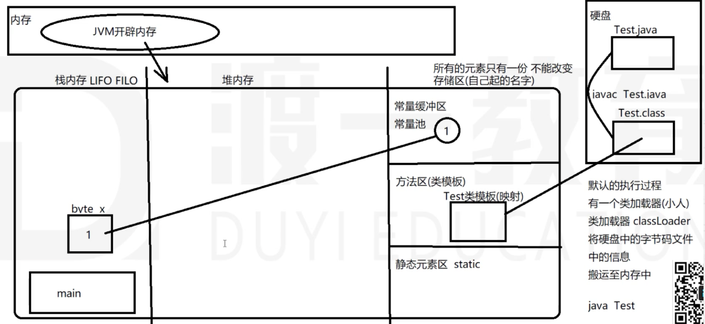

# 介绍及环境搭建

## Java介绍

- Java语言可以编写跨平台应用软件的面向对象程序语言

- 什么是跨平台？

  不依赖于操作系统，也不依赖于硬件环境

- 什么是面向对象？

  把数据和对数据的操作都封装在一起，作为一个整体

- 版本说明

  - 标准版    Standard Edition     JavaSE
  - 企业版    Enterprise Edition    JavaEE
  - 微型版    Micro Edition       JavaME

- 特点：跨平台性、面向对象、简单性、健壮性、多线程、大数据开发相关

## 环境搭建

JDK：Java Development Kit(Java 开发工具包)

安装JDK步骤：

1. 下载JDK：[www.oracle.com](http://www.oracle.com/)
2. 安装:双击安装文件，可自定义安装路径
3. 配置环境变量：JAVA_HOME(JDK安装路径)、CLASSPATH(一般设置lib/tools.jar和lib/dt.jar)、PATH(环境变量，需要将java的exe执行文件配置，目录JAVA_HOME/bin)

JDK、JRE、JVM关系：运行一个java程序最小环境为JRE，开发一个Java程序最小环境为JDK。

- [^JDK]: Java Development Kit（Java开发工具包）

- [^JRE]: Java Runtime Environment（Java运行环境）

- [^JVM]: Java Virtual Machines（Java虚拟机）

## 编译过程

- 程序员编写的java源文件（.java）首先要经过jvm编译，生存所谓的字节码文件（.class）

  ​	javac *.java：编译.java文件为.class文件

- java程序的运行需要JVM的支持，JVM是一个软件，安装在操作系统中，为字节码文件提供运行环境

# 基本语法

## 基础数据类型

**8种基本数据类型:**

| 数据类型 | 类型名称 | 字节空间    | 使用场景                        |
| -------- | -------- | ----------- | ------------------------------- |
| 整数     | byte     | 1字节(8位)  | 存储字节数据(较常用)            |
| 整数     | short    | 2字节(16位) | 兼容性考虑(很少使用)            |
| 整数     | int      | 4字节(32位) | 存储普通整数(常用)              |
| 整数     | long     | 8字节(64位) | 存储长整数(常用)                |
| 浮点     | float    | 4字节(32位) | 存储浮点数(不常用)              |
| 浮点     | double   | 8字节(64位) | 存储双精度浮点数(常用)          |
| char     | char     | 2字节(16位) | 存储一个字符(常用)              |
| 布尔     | boolean  | 1字节(8位)  | 存储逻辑变量(true、false)(常用) |

[^字节]:计算机中存储量的单位

8位=1B(字节)、1024B = 1KB(千字节)、1024KB = 1M(兆)、1024M = 1G

- **int** 

  - int 是最常用的整数类型，一个int类型的变量占用4个字节(32位)，最大表示范围：

    -2^31~2^31-1即-2147483648～2147483647

  - 无论保存多大的数据都是占用4个字节，当超出最大保存返回，就会出现编译失败。

  - 整数直接量：直接写入的整数，如果 int a = 100；那么100就是直接量。

  - 两个整数相除，会舍弃小数部分，不做四舍五入。

  - 在做运算时，需要防止溢出的发生：

    - 正数过大发生溢出结果是负数
    - 负数过大发生溢出结果是正数

- **long**

  比int类型存储范围更大的整数类型，当int类型范围不够，可以使用long类型进行存储。

  - 一个long类型的变量占用8个字节，最大范围：-2^63~2^63-1
  - 如果直接量操作int类型最大值，则必须以l或者L结尾作为直接量。

- **double**

  浮点数就是小数，包括float和double。

  - 因为double类型的误差比float类型小，所以在计算小数的时候都是使用double类型。
  - 如果需要表示float的直接量，需要加f或者F，如:float a = 3.14F

- **char**

  - 字符类型本质上是一个16位无符号整数，这个整数是该字符的unicode编码。
  - unicode是将地球上主要的语言中的每个文字符号都对应1个号。
  - 计算机中存字符都是存字符对应的数字。
  - 直接使用字符即可，不必关心每个字符的数字，但必须用单银号包括。
  - 一个字符变量中只能存1个字符。
  - 常用char类型数值操作：‘0’～‘9’：48～57；‘A’～‘Z’：65～90；’a’~’z’:97～122

- **基本类型间转换**

  不同的基本数据类型之间可以相互转换

  - 自动转换(隐式转换)：从小类型到大类型可以自动转换，参考以下规则：

    (byte➡️short)(char)➡️int➡️long

    float➡️double

  - 强制转换：从大类型转换成小类型，如：

    ```java
    char a = ‘a’; 
    char A = (char)(a-32);
    ```

  注意：

  - 多种基本数据类型参与的运算中，结果会自动向较大的类型进行转换
  - 强制将大类型转换成小类型极容易出现溢出或丢失精度
  - byte、short、char三种类型实际存储的数据都是整数
  - 在实际应用中：
    - int直接量可以直接赋给byte、short、char，只要不操作其表示的范围；
    - byte、short、char三种类型参与运算时，先一律转换成int类型再进行运算。

## 常量与变量

- **变量**

  - 定义：变量就是内存中开辟的一块存储空间，用于存放运行过程中所需要用到的数据，可以将变量理解为一个代词，指代它所存储的那个数据。
  - 说明：变量是一个空间，在声明(创建)的时候，必须指定存储数据类型，和变量空间名称，并且只能存储一个类容(值|引用)，变量空间内的内容可以改变。
  - 声明：
    - 数据类型 变量名，如：int a;
    - 如果数据类型一样，可以在一条语句中声明多个变量，如：int a,b,c;
    - 命名规范：
      - 可以由字母、数字、_和$符组成
      - 首字母不能以数字开头
      - 大小写敏感，命名时需要注意
      - 不能使用关键字，如：if、int、for、break等
      - 中文可以作为变量名称，但不推荐使用

- **常量**

  - 定义：程序运行过程中不能再次改变的值。

  - 源码编译运行过程：重要

    

## 运算符

- 算术运算符

  - 模运算(%)：取余，除法中不能被整除的部分
  - 自增(++)和自减(--):可以使变量的值加1或者减1
    - 语法：变量++或者++变量，在单独使用的情况下，都等效于：变量 = 变量 + 1
    - 在变量前++，表示在内存中先加1，然后再取出使用
    - 在变量后++，表示在内存中，先取出使用再加1
  - 算术运算符包括：+、-、*、/、%、++、--

- 赋值运算符

  将=右边的内容存入=左边的变量空间，包括：

  =、+=、-=、*=、/=、%=

- 关系运算符

  用于判断数据之间的大小，返回的结果都是boolean类型,包括：

  \>、<、<=、>=、==、!=、instanceof(对象 instanceof 类)

- 逻辑运算符

  参与逻辑运算的每个条件都是boolean类型，运算结果也是boolean类型，运算符包括：

  &&(且)、||(或)、&(逻辑与)、|(逻辑或)、^(逻辑异或:前后两个条件结果不一样，最终结果为true)、!(非)

  注意：

  - 逻辑与(&)与短路与(&&)的区别：逻辑与根据所有表达式结果确定最后结果，短路与一个表达式为false，后面表达式不用得到结果，最后结果为false。
  - 逻辑或(|)与短路或(||)的区别：逻辑或根据所有表达式结果确定最后结果，短路或一个表达式为true，后面表达式不用得到结果，最后结果为true。

- 位(bit)运算符

  先转换成二进制，然后按着对应位置进行计算(1为true,0为false),再转换为十进制。

  - 按位与(&)：同为1为1
  - 按位或(|)：一位为1为1
  - 按位异或(^)：异为1，同为0
  - 按位取反(~)：1为0，0为1
  - 按位左位移(<<)：乘以2的位移次方,6<<2=24相当于6乘以2的2次方
  - 按位右位移(>>)：除以2的位移次方,6>>1=3相当于6除以2的1次方
  - 按位右位移无符号位(>>>)：

- 知识补充

  **进制转换**

  - 十进制转换成二进制，以60为例：计算机中32个0或1来表示60，60除以2取余，然后将余数倒叙排列

    00000000 00000000 00000000 00111100

  - 二进制转换成十进制，以60为例：从右至左开始计算，每一个源数据乘以2的位置(0开始)次幂，最终求和

    00000000 00000000 00000000 00111100----->
    $$
    2^0*0+2^1*0+2^2*1+2^3*1+2^4*1+2^5*1
    $$

  - 八进制：将二进制的每三位计算成十进制，然后以0开头，将每个值拼在一起，如60->074

  - 十六进制：将二进制的每四位计算成十进制，表示形式以0x开头，10-15对应A-F，如60->0x3C

  **原码、反码、补码**

  | 数值 | 原码                                | 反码                                                      | 补码                                        |
  | ---- | ----------------------------------- | --------------------------------------------------------- | ------------------------------------------- |
  | 6    | 00000000 00000000 00000000 00000110 | 00000000 00000000 00000000 00000110                       | 00000000 00000000 00000000 00000110         |
  | -6   | 10000000 00000000 00000000 00000110 | 11111111 11111111 11111111 11111001(符号位不动，其余取反) | 11111111 11111111 11111111 11111010(反码+1) |

  计算机中不管是整数还是负数，存储的形式都是以补码的形式来存储，反码是一种表现形式，取反是一个计算过程(每一个位置都取反)

# 数组

# 面向对象

# 异常处理

# 多线程

# Java常用类

# 枚举&注解

# Java集合

# 泛型

# IO流

# 网络编程

# 反射机制

# JAVA8&9&10&11新特性